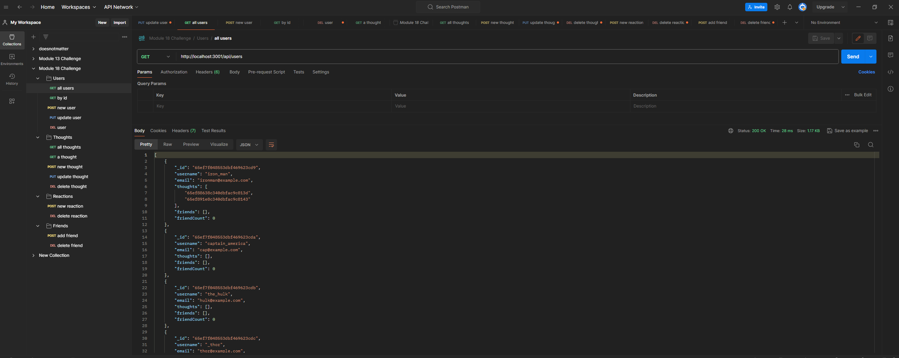
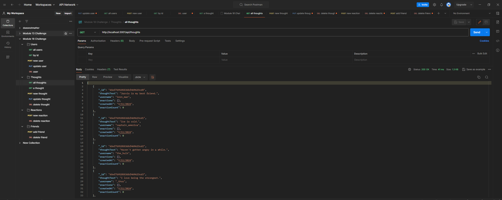
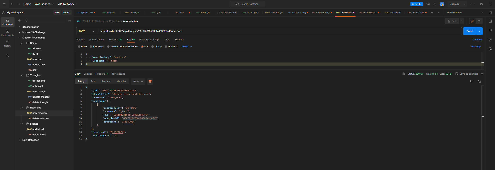
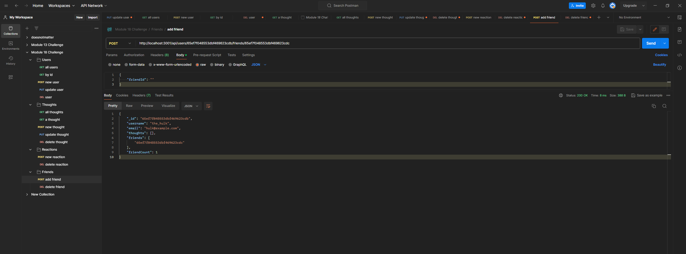
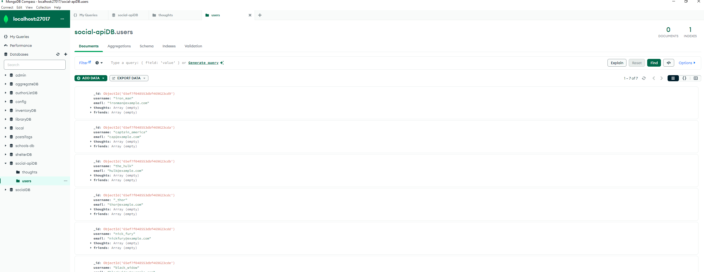
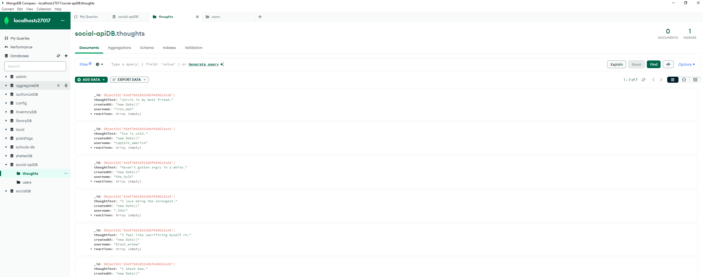

# NoSQL Challenge: Social Network API

## Description

This project involves building an API for a social network web application where users can share thoughts, react to friends' thoughts, and manage their friend list. The primary technologies used for this project are Express.js for routing, MongoDB as the database, and the Mongoose ODM. 

## Usage

Follow these steps to set up and run the project locally:

1. Clone the repository.
2. Install dependencies using `npm install`.
3. Configure MongoDB connection in the `connection.js` file.
4. Run the application with `node index.js`.

Follow my youtube walkthrough here: https://youtu.be/zv8TSIjtLWo

## Installation

Ensure you have Node.js and npm installed on your machine. Then, follow the steps below:

   - git clone [https://github.com/bcolo24/social-network-api.git]
   - cd social-network-api
   - npm install

## License
MIT License

Copyright (c) 2024 bcolo24

Permission is hereby granted, free of charge, to any person obtaining a copy
of this software and associated documentation files (the "Software"), to deal
in the Software without restriction, including without limitation the rights
to use, copy, modify, merge, publish, distribute, sublicense, and/or sell
copies of the Software, and to permit persons to whom the Software is
furnished to do so, subject to the following conditions:

The above copyright notice and this permission notice shall be included in all
copies or substantial portions of the Software.

THE SOFTWARE IS PROVIDED "AS IS", WITHOUT WARRANTY OF ANY KIND, EXPRESS OR
IMPLIED, INCLUDING BUT NOT LIMITED TO THE WARRANTIES OF MERCHANTABILITY,
FITNESS FOR A PARTICULAR PURPOSE AND NONINFRINGEMENT. IN NO EVENT SHALL THE
AUTHORS OR COPYRIGHT HOLDERS BE LIABLE FOR ANY CLAIM, DAMAGES OR OTHER
LIABILITY, WHETHER IN AN ACTION OF CONTRACT, TORT OR OTHERWISE, ARISING FROM,
OUT OF OR IN CONNECTION WITH THE SOFTWARE OR THE USE OR OTHER DEALINGS IN THE
SOFTWARE.

## Credits
Github: @BarkleyRhoat

Github: @Lychnian

## Contact Me:

Github: @bcolo24